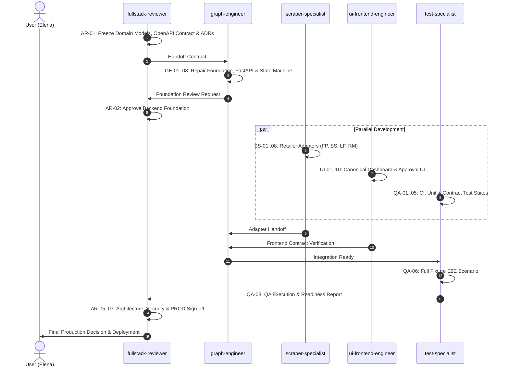

# Multi-Agent Workstream Governance & Ownership Manifest

This repository is organized into **five controlled workstreams** with strict file ownership, non-negotiable security rules, and staged handoffs.

---

## 🏛️ Workstream Summary & Model Recommendations

| Agent Role | Primary File Ownership | Recommended Model | Target Branch |
| :--- | :--- | :--- | :--- |
| **`graph-engineer`** | `apps/api/**`, `packages/domain/**`, `packages/orchestration/**`, migrations, runtime config | `gpt-5.6-sol`, xhigh | `refactor/domain-orchestration-foundation` |
| **`scraper-specialist`** | `packages/retailers/**`, `apps/browser_worker/**`, session scripts, redacted fixtures | `gpt-5.6-sol`, xhigh | `feat/live-retailer-adapters` |
| **`ui-frontend-engineer`** | `Frontend/src/**`, generated API client & types, frontend tests | `gpt-5.6-terra`, high | `feat/canonical-shopping-dashboard` |
| **`test-specialist`** | `tests/**`, `Frontend/**/__tests__/**`, `.github/workflows/**`, `docs/qa/**`, QA reports | `gpt-5.6-sol`, high | `test/full-workflow-readiness` |
| **`fullstack-reviewer`** | `docs/adr/**`, `docs/reviews/**`, architectural gates, security audit, PROD decision | `gpt-5.6-sol`, max | `review/production-readiness` |

---

## 🔒 Shared Non-Negotiable Rules

1. **Base Commit:** Start from `main` commit `7a6c7c3`.
2. **Live Purchases:** Disabled until final architectural sign-off by `fullstack-reviewer`.
3. **No Sensitive Data:** Never handle, store, or log card numbers, CVVs, passwords, OTPs, or CAPTCHA data.
4. **No Security Bypasses:** Never bypass retailer security controls, spoof user agents, or use stealth plugins.
5. **No Silent Mock Replacement:** Never silently replace failed live scraper calls with mock data. Retailer challenges must transition explicitly to `USER_ACTION_REQUIRED`. Test fixtures must be explicitly labelled.
6. **Deterministic Matching:** Never select the first search result without deterministic SKU/category/pack validation.
7. **Cart Ownership:** Never clear a retailer cart containing unknown items; return `CART_CONFLICT`.
8. **No Filler Items:** Never add filler products to reach free delivery.
9. **Post-Approval Lock:** Never substitute, add, remove, or change item quantity after user approval.
10. **Client Boundary:** The frontend must never submit authoritative items, prices, or totals (`quote_id` + `delivery_slot_id` only).
11. **Verified Receipts:** No order is successful without a real retailer confirmation number.
12. **Scope Discipline:** Work strictly in assigned directories and branch. Finish every assignment with changed files, commands run, failures, residual risks, and handoff notes.

---

## 🔄 Staged Execution & Merge Order

---

## 📁 Agent Specifications
- [`scraper-specialist/AGENT.md`](file:///c:/Users/dance/OneDrive/Documents/Grocery%20Shopping%20Assistant/Multi-Agent-AI-Grocery-Shopping-Assistant/.agents/agents/scraper-specialist/AGENT.md)
- [`graph-engineer/AGENT.md`](file:///c:/Users/dance/OneDrive/Documents/Grocery%20Shopping%20Assistant/Multi-Agent-AI-Grocery-Shopping-Assistant/.agents/agents/graph-engineer/AGENT.md)
- [`ui-frontend-engineer/AGENT.md`](file:///c:/Users/dance/OneDrive/Documents/Grocery%20Shopping%20Assistant/Multi-Agent-AI-Grocery-Shopping-Assistant/.agents/agents/ui-frontend-engineer/AGENT.md)
- [`test-specialist/AGENT.md`](file:///c:/Users/dance/OneDrive/Documents/Grocery%20Shopping%20Assistant/Multi-Agent-AI-Grocery-Shopping-Assistant/.agents/agents/test-specialist/AGENT.md)
- [`fullstack-reviewer/AGENT.md`](file:///c:/Users/dance/OneDrive/Documents/Grocery%20Shopping%20Assistant/Multi-Agent-AI-Grocery-Shopping-Assistant/.agents/agents/fullstack-reviewer/AGENT.md)
