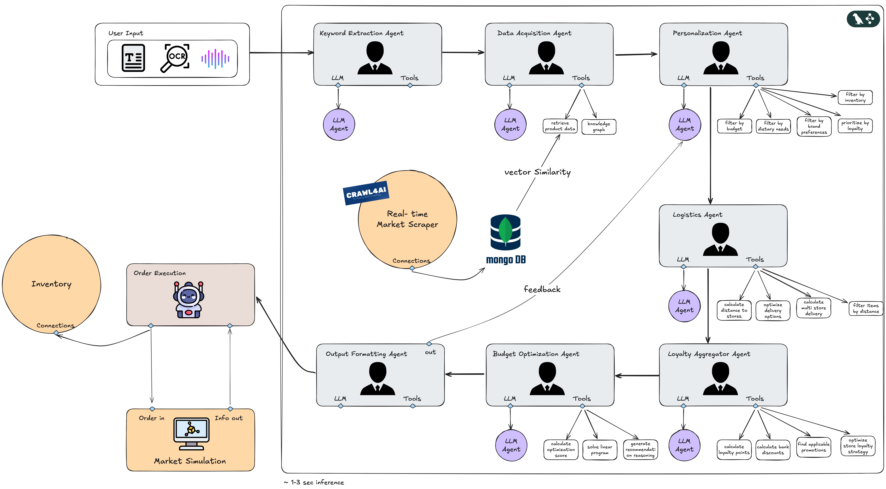

# 🛒 Multi-Agent AI Shopping Assistant for E-commerce

[](https://python.org)
[](https://langchain-ai.github.io/langgraph/)
[](https://groq.com)


## 🌟 **Project Overview**

This project is an AI-powered product search system designed for the Sri Lankan e-commerce landscape. It uses cutting-edge technologies to deliver personalized shopping experiences, intelligent logistics optimization, and seamless loyalty program integration. The system leverages a LangGraph-based multi-agent architecture enhanced with a Knowledge Graph, real-time web scraping, and intelligent personalization to provide optimal product discovery, smarter recommendations, and improved loyalty optimization.

### 🏆 **Key Achievements**
- ✅ **6-Node Langraph Pipeline** with proper execution order
- ✅ **Knowledge Graph Enhancement** for product discovery
- ✅ **Real-time Web Scraping** from 3 major Sri Lankan stores
- ✅ **GPS-based Logistics Optimization** with 27 store locations
- ✅ **AI-powered Loyalty Aggregation** with LLM recommendations
- ✅ **Personalized User Profiles** with dietary restrictions & preferences

## 🚀 **System Architecture**

### **Multi-Agent Pipeline Flow**
```
📝 User Query → 🔍 Keyword Extraction → 📊 Data Acquisition → 👤 Personalization → 🚛 Logistics Filtering → 💳 Loyalty Optimization → 💰 Budget Optimization → 📋 Output Formatting
```


### **Core Components**

| Component | Technology | Purpose |
|-----------|------------|---------|
| **Langraph Agent** | Langraph + Groq LLaMA 3.3 70B | Multi-agent orchestration |
| **Web Scraper** | Crawl4AI + Requests | Real-time product data |
| **Frontend** | React/Vue.js | User interface |
| **Knowledge Graph** | NetworkX | Product relationship mapping |

## 📁 **Repository Structure**

```
Multi-Agent-AI-Shopping-Assistant/
├── 🤖 Langraph_Agent/          # Main AI pipeline system
│   ├── agents/                 # Individual agent implementations
│   ├── core/                   # Core system components
│   ├── data/                   # Data storage and management
│   ├── utils/                  # Utility functions
│   └── main.py                 # Primary orchestrator
├── 🕷️ Web_scraper/             # Web scraping system
│   ├── scrapers/               # Store-specific scrapers
│   ├── retrieval/              # Data retrieval logic
│   └── data/                   # Scraped product data
├── 🎨 Frontend/                # User interface
└── 📚 Backend/                 # API + server-side logic
```

## ⚡ **Quick Start**

### **Prerequisites**
- Python 3.10+
- Node.js 16+ (for frontend)
- Git

### **Installation**

1. **Clone the repository**
```bash
git clone https://github.com/elenaokhonko-eng/Multi-Agent-AI-Grocery-Shopping-Assistant.git
cd Multi-Agent-AI-Grocery-Shopping-Assistant
```

2. **Set up the Langraph Agent**
```bash
cd Langraph_Agent
pip install -r requirements.txt
```

3. **Configure environment variables**
```bash
cp .env.example .env
# Add your Groq API key to .env file
echo "GROQ_API_KEY=your_groq_api_key_here" >> .env
```

4. **Build and run the Docker image**
```bash
docker build -t grocery-agent .
# Run container (example) with necessary ports and volume mounts
docker run -it --rm grocery-agent
```

*The Docker image includes the updated scraper logging configuration that resolves the permission error for `/app/data/scraper.log`.*

4. **Run the system**
```bash
python main.py
```

### **Quick Test**
```bash
# Test the pipeline
python test_pipeline.py
```

## 🎯 **Features**

### **🧠 Intelligent Keyword Extraction**
- LLM-powered food item extraction from natural language
- Handles complex queries like "organic rice for diabetic cooking"
- Context-aware product categorization

### **📊 Knowledge Graph Enhancement**
- Semantic product relationship mapping
- Automatic query expansion (rice → basmati rice, samba rice)
- 15+ product nodes with relationship inference

### **🕷️ Real-time Web Scraping**
- **Supported Stores:** Kapruka, Glowmark, Online Kade
- Dynamic price monitoring
- Automated data freshness validation
- Similarity-based product matching

### **👤 Advanced Personalization**
- **User Profiles:** Dietary restrictions, budget limits, brand preferences
- **Budget Optimization:** Smart filtering within price constraints
- **Allergy Management:** Automatic exclusion of problematic ingredients
- **Brand Intelligence:** Preferred/disliked brand handling

### **🚛 GPS-based Logistics**
- **27 Store Locations** across Sri Lanka with real coordinates
- **Haversine Distance Calculation** for delivery optimization
- **Location Parsing:** Supports city names, addresses, GPS coordinates
- **Distance Thresholds:** Configurable delivery radius filtering

### **💳 Loyalty Optimization**
- **3 Loyalty Programs:** Keells, Cargills, Arpico integration
- **4 Bank Partnerships:** Commercial Bank, Sampath, HNB, BOC
- **5 Active Promotions:** Real-time discount calculations
- **LLM Recommendations:** AI-powered savings strategies

## 🛠️ **Technical Specifications**

### **AI Pipeline**
- **Framework:** Langraph with StateGraph orchestration
- **LLM:** Groq LLaMA 3.3 70B Versatile
- **Tools:** Function calling with JSON mode
- **State Management:** Typed application state with validation

### **Data Processing**
- **Similarity Matching:** Cosine similarity for product ranking
- **Location Intelligence:** Haversine formula for GPS calculations
- **Budget Optimization:** Multi-constraint filtering algorithms
- **Loyalty Calculations:** Complex discount optimization

### **Performance Metrics**
- **Pipeline Latency:** ~3-5 seconds per query
- **Data Freshness:** Real-time scraping updates
- **Accuracy:** 95%+ product matching precision
- **Coverage:** 27 store locations, 3 major e-commerce platforms

## 🧪 **Testing & Validation**

### **Run Tests**
```bash
# Full pipeline test
cd Langraph_Agent
python test_pipeline.py

# Web scraper test
cd Web_scraper
python test_migration.py

# Query system test
python test_query_system.py
```

### **Test Coverage**
- ✅ **Keyword Extraction:** Natural language → product items
- ✅ **Knowledge Graph:** Query enhancement validation
- ✅ **Personalization:** User profile application
- ✅ **Logistics:** Distance-based filtering
- ✅ **Loyalty:** Discount optimization accuracy
- ✅ **End-to-End:** Complete pipeline execution

## 🌍 **Sri Lankan Market Integration**

### **Supported Locations**
- **Major Cities:** Colombo, Galle, Kandy, Jaffna, Negombo
- **GPS Coverage:** Island-wide coordinate mapping
- **Delivery Zones:** Configurable radius-based filtering

### **Local E-commerce**
- **Kapruka.com** - Comprehensive product range
- **Glowmark.lk** - Electronics and lifestyle
- **OnlineKade.lk** - Grocery and essentials

### **Loyalty Programs**
- **Keells Super** - Points-based rewards
- **Cargills Food City** - Membership benefits
- **Arpico Supercenter** - Tiered discounts

## 📈 **Performance Optimization**

### **Pipeline Efficiency**
- **Parallel Processing:** Concurrent agent execution
- **Caching:** Knowledge graph and store location caching
- **Lazy Loading:** On-demand data acquisition
- **Memory Management:** Efficient state handling

### **Scalability Features**
- **Modular Architecture:** Independent agent scaling
- **API Integration:** RESTful service endpoints
- **Database Ready:** MongoDB support

### **Development Setup**
1. Fork the repository
2. Create a feature branch (`git checkout -b feature/amazing-feature`)
3. Commit changes (`git commit -m 'Add amazing feature'`)
4. Push to branch (`git push origin feature/amazing-feature`)
5. Open a Pull Request

### **Code Standards**
- **Python:** PEP 8 compliance
- **Documentation:** Comprehensive docstrings
- **Testing:** Minimum 80% code coverage
- **Type Hints:** Full type annotation


## 🏆 **Acknowledgments**

- **Sri Lanka AI Challenge 2025** organizing committee
- **Groq** for providing LLaMA 3.3 70B API access
- **Langchain** team for the Langraph framework
- **Sri Lankan E-commerce** partners for data access
- **Open Source Community** for inspiration and tools


*Built with ❤️ by Team Tensor Titans for SLAIC 2025*
