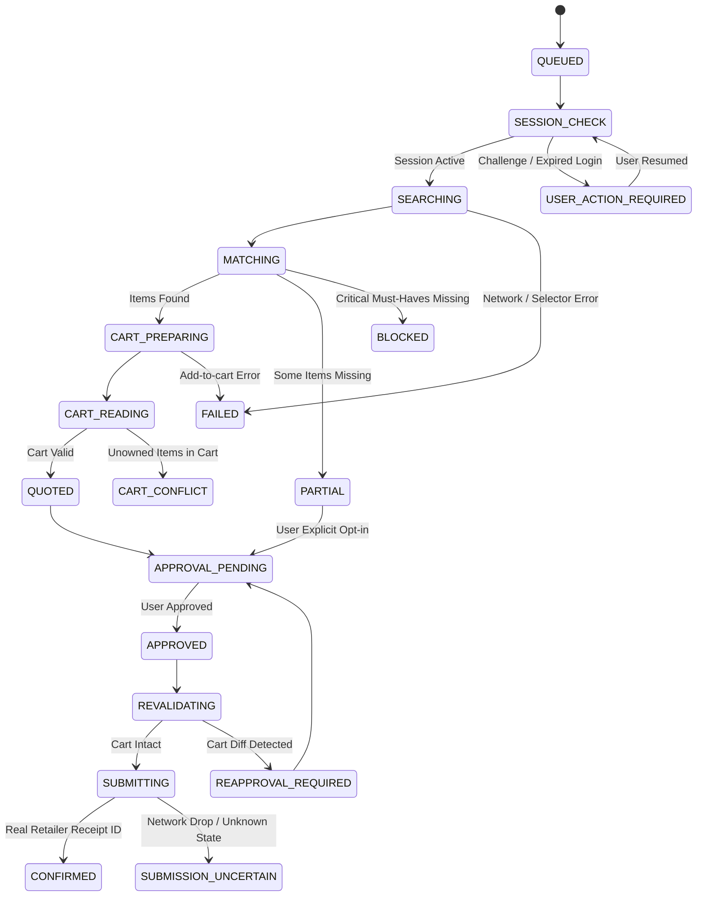

# ADR-003: Retailer Adapter Interface, State Machine & Error Taxonomy

**Status:** APPROVED & FROZEN  
**Author:** Chief Architect (`fullstack-reviewer`)  
**Scope:** `packages/retailers/**`, `packages/orchestration/**`

---

## 1. Context & Motivation
To prevent ad-hoc scraper scripts and uncoordinated scraper failures from crashing the orchestration graph, this ADR defines the standardized `RetailerAdapter` interface, the 18 deterministic store lifecycle states, and the formal error taxonomy.

---

## 2. Retailer Adapter Abstract Base Class

All retailer modules (`fairprice`, `shengsiong`, `littlefarms`, `redmart`) must inherit from `RetailerAdapter` in `packages/retailers/base.py`:

```python
from abc import ABC, abstractmethod
from typing import List, Optional, Dict, Any
from pydantic import BaseModel
from datetime import datetime


class SessionStatus(BaseModel):
    is_authenticated: bool
    user_name: Optional[str] = None
    requires_action: bool = False
    action_type: Optional[str] = None  # "LOGIN_EXPIRED", "CAPTCHA", "OTP", "ACCOUNT_ALERT"
    resume_token: Optional[str] = None


class CandidateProduct(BaseModel):
    store_id: str
    retailer_sku: str
    title: str
    brand: Optional[str] = None
    category: Optional[str] = None
    price_cents: int
    pack_size: Optional[str] = None
    unit_measure: str
    unit_price_cents: int
    image_url: Optional[str] = None
    product_url: str
    in_stock: bool
    rejection_reason: Optional[str] = None


class CartLine(BaseModel):
    retailer_sku: str
    title: str
    quantity: int
    unit_price_cents: int
    line_total_cents: int


class AuthoritativeCart(BaseModel):
    retailer_id: str
    cart_id: Optional[str] = None
    cart_url: Optional[str] = None
    lines: List[CartLine]
    subtotal_cents: int
    delivery_fee_cents: int = 0
    service_fee_cents: int = 0
    bag_fee_cents: int = 0
    slot_fee_cents: int = 0
    gross_total_cents: int
    free_delivery_threshold_cents: Optional[int] = None
    unowned_items_detected: bool = False


class DeliverySlot(BaseModel):
    slot_id: str
    start_time: datetime
    end_time: datetime
    fee_cents: int = 0
    is_available: bool = True
    display_label: str


class CartDiff(BaseModel):
    has_changes: bool
    price_changed: bool = False
    old_total_cents: int
    new_total_cents: int
    items_out_of_stock: List[str] = []
    items_price_changed: List[Dict[str, Any]] = []
    slot_changed: bool = False


class OrderConfirmation(BaseModel):
    retailer_order_id: str
    confirmed_total_cents: int
    delivery_slot: str
    receipt_url: Optional[str] = None
    is_uncertain: bool = False


class RetailerAdapter(ABC):
    retailer_id: str

    @abstractmethod
    async def check_session(self) -> SessionStatus:
        """Verify session validity or return USER_ACTION_REQUIRED."""
        pass

    @abstractmethod
    async def resolve_pinned_sku(self, sku: str) -> Optional[CandidateProduct]:
        """Directly retrieve product by exact pinned SKU ID."""
        pass

    @abstractmethod
    async def search_candidates(self, query: str, category_hint: Optional[str] = None) -> List[CandidateProduct]:
        """Search top-N candidates from store search."""
        pass

    @abstractmethod
    async def validate_candidate(self, candidate: CandidateProduct, desired_item: Any) -> bool:
        """Apply deterministic brand, pack, unit, and exclusion gates."""
        pass

    @abstractmethod
    async def add_exact_item(self, sku: str, quantity: int) -> bool:
        """Add exact validated SKU to cart."""
        pass

    @abstractmethod
    async def read_cart(self) -> AuthoritativeCart:
        """Read authoritative basket lines and fees directly from store DOM/API."""
        pass

    @abstractmethod
    async def list_delivery_slots(self) -> List[DeliverySlot]:
        """Fetch real available delivery slots."""
        pass

    @abstractmethod
    async def select_delivery_slot(self, slot_id: str) -> bool:
        """Select delivery slot in retailer checkout session."""
        pass

    @abstractmethod
    async def revalidate_cart(self, expected_fingerprint: str) -> CartDiff:
        """Re-read cart prior to submission and compare against fingerprint."""
        pass

    @abstractmethod
    async def submit_order(self, approval_token: str) -> OrderConfirmation:
        """Execute final checkout click when live ordering is enabled."""
        pass
```

---

## 3. Store State Machine (18 Deterministic States)



---

## 4. Error Taxonomy & Standard Error Codes

| Error Code | HTTP Status | Description | Action Required |
| :--- | :--- | :--- | :--- |
| `CART_CONFLICT` | `409` | Retailer cart already contains unowned items from outside this run | Prompt user to inspect/clear cart |
| `USER_ACTION_REQUIRED` | `200 / 401` | Retailer presented CAPTCHA, OTP, or login expiry | Emit SSE event with resume token |
| `SKU_UNAVAILABLE` | `422` | Pinned SKU is delisted or 404s | Fallback to search query |
| `OUT_OF_STOCK` | `200` | Matched product is out of stock | Mark line as missing |
| `SLOT_UNAVAILABLE` | `409` | Selected delivery slot expired or became full | Prompt user to select new slot |
| `REAPPROVAL_REQUIRED`| `409` | Cart total, line item, or stock changed prior to submit | Render CartDiff modal for reapproval |
| `LIVE_PURCHASE_DISABLED` | `403` | Safety flag prevented final order placement click | Return mocked or stopped confirmation |
| `SUBMISSION_UNCERTAIN` | `502` | Order was clicked but browser disconnected before receipt ID | Display manual check warning |
| `RETAILER_BLOCKED` | `503` | Store WAF blocked IP | Halt store run; do not retry endlessly |
