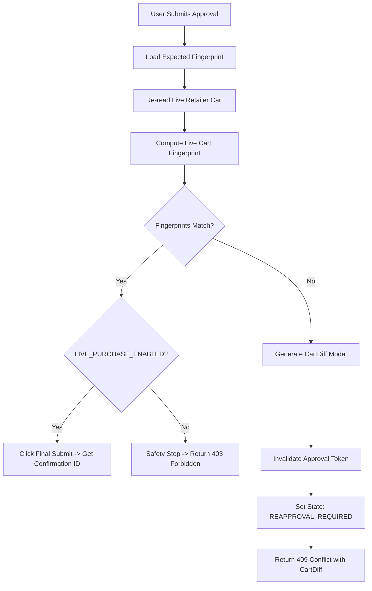

# ADR-004: Transaction Integrity, Quote Fingerprint & Single-Use Approval Gate

**Status:** APPROVED & FROZEN  
**Author:** Chief Architect (`fullstack-reviewer`)  
**Scope:** `packages/domain/**`, `apps/api/**`, `packages/retailers/**`

---

## 1. Context & Motivation
In an autonomous multi-agent purchasing workflow, the user must have absolute certainty that the final basket purchased matches the exact basket they reviewed and approved.

This ADR defines:
1. The **Deterministic Quote Fingerprint** algorithm.
2. The **Strict Server-Authoritative Approval Gate**.
3. **Cart Revalidation & Reapproval Triggers**.
4. **Idempotency & Race-Condition Prevention**.
5. **Enforcement of the `LIVE_PURCHASE_ENABLED` Safety Guard**.

---

## 2. Deterministic Quote Fingerprint Algorithm

A quote fingerprint is an immutable cryptographic hash (`SHA-256`) of the canonical normalized basket representation.

### Fingerprint Payload Structure
```python
import hashlib
import json
from typing import List, Dict, Any


def compute_quote_fingerprint(
    retailer_id: str,
    lines: List[Dict[str, Any]],
    delivery_slot_id: str,
    subtotal_cents: int,
    fees_total_cents: int,
    gross_total_cents: int
) -> str:
    # 1. Normalize line items: sort deterministically by SKU
    normalized_lines = []
    for line in sorted(lines, key=lambda x: str(x["retailer_sku"])):
        normalized_lines.append({
            "sku": str(line["retailer_sku"]).strip(),
            "quantity": int(line["quantity"]),
            "unit_price_cents": int(line["unit_price_cents"]),
            "line_total_cents": int(line["line_total_cents"])
        })

    # 2. Build canonical payload dictionary
    canonical_payload = {
        "retailer_id": str(retailer_id).lower().strip(),
        "lines": normalized_lines,
        "delivery_slot_id": str(delivery_slot_id).strip(),
        "subtotal_cents": int(subtotal_cents),
        "fees_total_cents": int(fees_total_cents),
        "gross_total_cents": int(gross_total_cents)
    }

    # 3. Serialize as strict sorted JSON and hash
    serialized = json.dumps(canonical_payload, sort_keys=True, separators=(",", ":"))
    return hashlib.sha256(serialized.encode("utf-8")).hexdigest()
```

---

## 3. Strict Approval & Submission Boundary

### 3.1 Client Request Constraints
The frontend client is strictly prohibited from sending items, SKU lists, prices, discounts, or total amounts.

The client submits only:
```json
POST /quotes/{quote_id}/approve
{
  "delivery_slot_id": "slot_fp_20260829_morning"
}
```

```json
POST /approvals/{approval_id}/submit
{
  "approval_token": "tok_sec_1234567890abcdef"
}
```

---

## 4. Revalidation & Reapproval Triggers

Before submitting an order, the system **must re-read the live retailer basket**.



### Mandatory Reapproval Conditions (Any of the following triggers `REAPPROVAL_REQUIRED`):
1. Any item price change (> 0 cents difference).
2. Any item becomes out of stock or pack size changes.
3. Delivery slot fee or delivery fee changes.
4. Total price increases by even 1 cent.
5. Substitution occurs without prior explicit approval.

---

## 5. Live Purchase Safety & Idempotency

1. **Idempotency Lock:** Every approval record is single-use (`is_used = true` immediately upon initiating submission). Concurrent calls with the same token are rejected with `409 Conflict`.
2. **Feature Flag Guard:** `LIVE_PURCHASE_ENABLED` is checked inside the adapter right before the browser submit event.
3. **No Phantom Orders:** An order is recorded as `CONFIRMED` only when a real retailer confirmation number is extracted from the receipt DOM. If browser connection drops during submit, state is marked `SUBMISSION_UNCERTAIN` and automated retries are strictly blocked.
